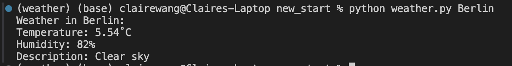

# CLI weather tool 命令行天气查询
- 输入城市名获取天气。  
Type in city name and get its weather.
- 支持多单位系统，包括开尔文（K）、摄氏度（˚C）和华氏度（˚F），默认为摄氏度。  
Support variable unit system, including standard, metric and imperial (metric by default)

### 演示 Demo


### 安装 Installation
首先安装依赖。
```bash
`pip install requests`  
`pip install python_dotenv`   
```
接下来，来到open weather的官网，注册即可获得API（https://openweathermap.org ）。把API放进环境文件里。  

## 笔记 Notes
这是我Coding计划的第一个项目。对于Coding计划的描述，可以等本阶段结束后在本人git主页找到。

本项目的目的在于，通过一个有趣的实现，帮助我从纯粹的做题来到现实的代码世界，用Coding的方式做出实际能用的东西。此工具脚本的思路很简单，因此我可以把重心放在“如何像模像样写出一个能用的工具，并使用git，然后提交GitHub”上。我需要学习考虑如何让别人明白我的代码，代码的架构，如何设置环境变量，以及如何保护自己的信息和处理错误。这才是本项目真正的挑战（challenge）。

本项目的实现思路：本人从0开始。首先让grok生成了项目框架和具体实现的代码（代码可以在references文件夹中找到，含有我的批注）。然后我通过查资料学习，弄明白了项目的架构，并学习了所用到的工具包。脚本本身思路很简单，我需要学习的是如何使用合适的工具和方法把它实现。在学习完成后，我对grok的代码做出了一些改进，比如修正了单位输出不跟随单位变化的问题。最后，我在chatGPT的引导下学习如何把整个项目上传至Git和GitHub，包括如何设置gitignore文件。整个过程就像有一位熟练的老师父带领我完成，很多细节也能提示到。我相信整个计划结束，我收获到不仅仅是代码能力，也有一份新时代下如何通过AI快速学习编程的思路，以及具有恒久和普遍价值的反思日记。

为什么本项目不是抄作业：伟大的实现都是从模仿开始。既然这只是一个为了让我练习语法的markdown文档，我就不在此多赘述。相关通过AI学习的议题，我将在计划结束后统一撰文论述。这是一个一边实践，一边反思的过程。
